# 🛠️ สรุปการทำงาน — Smart Mechanical Service Management (งานบำรุงรักษาตามวาระ · To-be)

> **ที่มา:** แผนผัง *User Journey — Smart Mechanical Service Management (งานบำรุงรักษาที่ To be)* (ภาพ flow รถก่อสร้าง PEA)
> **ขอบเขต:** งาน **บำรุงรักษาตามวาระ (Preventive Maintenance)** ของเครื่องกล/รถก่อสร้าง — วางแผนล่วงหน้าเป็นราย **ไทรมาส** ไม่ใช่งานแจ้งซ่อมเฉพาะกิจ
> **ระบบหลัก:** VMS Plus (VMS+) · ระบบขออะไหล่ (App) · PEA Life
> **ความสัมพันธ์กับเอกสารเดิม:** ต่อยอดจาก [F11 — บำรุงรักษาตามวาระ (PM)](../ฟังก์ชัน/F11-บำรุงรักษาตามวาระ-PM.md) และเทียบเคียงกับ flow งานซ่อมของ [กบค.](../flow-กบค/01-สรุปการทำงาน-Flow-กบค.md)
>
> 🎨 **โน้ตการอ่านสี:** ในแผนผังต้นทาง — กล่อง **ม่วง = ดำเนินการบนระบบ VMS+**, กล่อง **ส้ม/น้ำตาล = ดำเนินการนอกระบบ (offline)**
> ⚠️ **ตัวย่อหน่วยงาน:** แผนผังเขียนหน่วยงานหลักว่า **"กบก."** ซึ่งอาจเป็นตัวเดียวกับ **"กบค." (กองบำรุงรักษาเครื่องกล)** ในเอกสารชุดเดิม — ต้องยืนยันตัวย่อทางการก่อนอ้างอิงจริง (ดู [คำถามเปิด](#คำถามเปิด))

---

## 👥 ผู้เกี่ยวข้อง (Actors)

| รหัส | บทบาท | หน้าที่ใน flow |
|---|---|---|
| A1 | **กบก.** (หน่วยบำรุงรักษาเครื่องกล) ⚠️ | สร้างแผนบำรุงรักษา · ออกเลขงาน · ทำแผนเดินทาง (กรณีตรวจเอง) · ตรวจสอบแผนผู้รับจ้าง · บำรุงรักษาเอง · ตรวจรับ · จัดทำรายงาน · คำนวณต้นทุน |
| A2 | **ผบพ.** ❓ | ตรวจอะไหล่ที่ต้องใช้ในช่วงไทรมาสนั้น เพื่อเตรียมของไว้ล่วงหน้า |
| A3 | **ผู้รับจ้าง** (Outsource) | กรณี **ว่าจ้าง** — ทำแผนเดินทาง · เดินทาง/รับอะไหล่ที่จุดรวมงาน · บำรุงรักษา · ถ่ายรูป · บันทึกผลบน VMS+ · ส่งคืนอะไหล่ที่ไม่ได้ใช้ |
| A4 | **กรย.** (คลัง/ยานพาหนะ) | เบิก/เตรียมอะไหล่ก่อนวันเดินทาง · นำอะไหล่ไปวางที่จุดรวมงาน · รับแจ้งวันเดินทาง |
| A5 | **เจ้าของรถ** (หน่วยงานเจ้าของ) | รับ Noti วันเข้าตรวจ/ผลตรวจน้ำมัน |
| A6 | **หน่วยงานพัสดุ** | รับทราบผลงาน — ใบตรวจสอบอะไหล่ · ใบตรวจสภาพงานบำรุงรักษา · ประเมินความพึงพอใจ |
| A7 | **ผู้บังคับบัญชา กบก.** | ตรวจสอบประวัติงานบำรุงรักษา · อนุมัติปิดงาน / ตีกลับให้แก้ไข |
| S1 | **VMS Plus (VMS+)** | สร้างเอกสาร · ส่ง Noti · บันทึกงาน/อะไหล่ · รายงานผลและต้นทุน (Export Excel) |
| S2 | **ระบบขออะไหล่ (App)** | ตรวจสอบ/เบิกอะไหล่ |
| S3 | **PEA Life** | ทำใบนำจ่าย (กรณีตรวจเอง) |

\* ตัวย่อ **กบก. / ผบพ. / กรย.** ถอดจากภาพแผนผังโดยตรง ควรยืนยันชื่อเต็มและขอบเขตหน่วยงานก่อนใช้อ้างอิง

---

## 🔁 ภาพรวมการทำงาน (เดินตาม flow · 6 ช่วง)

### ช่วงที่ 1 — ออกเลขงาน (Master Plan)
1. **กบก. สร้างแผนบำรุงรักษา (Master Plan)**
2. **เลือกเกณฑ์** — ทรัค / เนต (เกณฑ์คัดรถเข้าแผน)
3. **เลือกรถเข้าแผน**
4. ระบบ **แสดงรายการอะไหล่ที่ต้องบำรุงรักษา** — น้ำมันต่างๆ · ไส้กรองต่างๆ
5. **ระบุช่วงเวลา (ไทรมาส)**
6. **ผบพ. เข้ามาตรวจอะไหล่** ที่จะใช้ในช่วงไทรมาสนั้น เพื่อ **เตรียมของไว้ล่วงหน้า**
7. **ขออนุมัติเลขงาน**
8. **ตรวจสอบจำนวนรถปัจจุบันตามแผน** — สถานะ: ไม่ใช้ / รออนุมัติ / โอน

> 📝 **Noted (จากแผนผัง):**
> - ต้อง **Set up ข้อมูลอะไหล่** (เก็บ/แสดงประกอบ) ไว้ก่อน
> - น้ำมันที่เกี่ยวข้อง: **น้ำมันเครื่อง · น้ำมันเฟือง · น้ำมัน Hydraulic**

### ช่วงที่ 2 — เบิก/จัดหาอะไหล่ · จ้างดำเนินการ · เตรียมดำเนินการ
9. **ตรวจสอบและเบิกอะไหล่** ผ่าน **ระบบขออะไหล่ (App)**
10. **ตัดสินใจ: ว่าจ้าง หรือ ตรวจเอง?** — แตกเป็น 2 เส้นทาง

**🅰️ เส้นทาง "ว่าจ้าง" (ผู้รับจ้างภายนอก)**
- หา **ผู้รับจ้าง / เสนอราคา**
- **กบก. กำหนดอัตราค่าจ้าง**
- **ผู้รับจ้างทำแผนเดินทาง**
- **กบก. ตรวจสอบแผนของผู้รับจ้าง**
- เลือกรถที่จะบำรุงรักษา → ระบุสถานที่ → **กำหนดวันเดินทางเป็นช่วง**
- **ทำ PO**
- **แจ้ง กรย. ทราบวันเดินทาง**

**🅱️ เส้นทาง "ตรวจเอง" (กบก. ดำเนินการเอง)**
- **กบก. ทำแผนเดินทาง**
- ใส่ข้อมูลพนักงาน กบก. (ช่อง 2–3) — กรอก **ค่าเบี้ยเลี้ยง · ที่พัก · ค่าเดินทาง**
- เลือกรถที่จะบำรุงรักษา → ระบุสถานที่ → **กำหนดวันเดินทางเป็นช่วง**
- **กบก. ยืนยันการสร้างแผนเดินทาง**
- **ระบบส่ง Noti** แจ้งเจ้าของรถ + กรย. วันที่เข้าไปตรวจ
- **กบก. ทำใบนำจ่ายด้วย PEA Life**

### ช่วงที่ 3 — ดำเนินการบำรุงรักษา
เตรียมอะไหล่ (ทั้ง 2 เส้นทาง):
- **กรย. เข้าไปเอาอะไหล่ก่อนวันเดินทาง** → นำ **อะไหล่ไปวางที่จุดรวมงานต่างๆ**
- **VMS+ สร้างเอกสารให้ กบก.**

**🅰️ กรณีว่าจ้าง (ผู้รับจ้าง):**
- ผู้รับจ้าง **เดินทางไปจุดรวมงาน → รับอะไหล่** → **เดินทางไปจุดหน้างาน**
- **ตัดสินใจ: บำรุงรักษาได้หรือไม่?**
  - **ไม่ได้** → ผู้รับจ้าง **บันทึกเหตุผลที่บำรุงรักษาไม่ได้**
  - **ได้** → ดำเนินการต่อ ⬇️
- **ถ่ายรูปก่อนบำรุงรักษา** — รูปรถ + ทะเบียน + อะไหล่ใหม่
- **ดำเนินการบำรุงรักษา**
- **เก็บตัวอย่างน้ำมันไฮโดรลิคไปทดสอบ**
- **บันทึกงานบำรุงรักษา + อะไหล่บน VMS+** (ยืนยันจำนวนอะไหล่ที่ใช้จริง) — เลขไมล์รถ · ชั่วโมงเครื่องจักร
- **ถ่ายรูปหลังบำรุงรักษา** — รูปรถ + ทะเบียน + อะไหล่เก่า · จุดที่บำรุงรักษา (อะไหล่ใหม่) · เลขไมล์ · ชั่วโมงเครื่องจักร
- **หน่วยงานพัสดุรับทราบ** — ใบตรวจสอบอะไหล่ · ใบตรวจสภาพงานบำรุงรักษา · ประเมินความพึงพอใจ

**🅱️ กรณีตรวจเอง (กบก.):** ขั้นตอนเหมือนกัน แต่ **กบก. เป็นผู้ทำเองทั้งหมด** เพิ่มเติม:
- **ระบบส่ง Noti** แจ้งเจ้าของรถว่าใกล้ถึงวันเข้าตรวจแล้ว
- กบก. เดินทางไปจุดรวมงาน → รับอะไหล่ → เดินทางไปหน้างาน → ถ่ายรูปก่อน → บำรุงรักษา → เก็บตัวอย่างน้ำมันไฮโดรลิค → บันทึกบน VMS+ → ถ่ายรูปหลัง → หน่วยงานพัสดุรับทราบ

> 📝 **Noted (ข้อมูลที่บันทึก):** ตัวอย่างน้ำมัน/ผลตรวจ · อะไหล่ที่ใช้ · วันที่ + รูปถ่าย ประกอบใบงาน

### ช่วงที่ 4 — ตรวจรับ
11. **กบก. ตรวจสอบข้อมูลการบำรุงรักษา**
12. **ผ่านหรือไม่?**
    - **ผ่าน** → เข้าสู่ขั้นตอนคืนอะไหล่/จัดทำรายงาน
    - **ไม่ผ่าน** → **กบก. ตรวจสอบสาเหตุ** → **แก้ไขได้หรือไม่?**
      - **ไม่ได้** → **ขออนุมัติปรับลดงาน**
13. **ผู้รับจ้างส่งคืนอะไหล่/น้ำมันที่ไม่ได้ใช้** ให้ กบก.

### ช่วงที่ 5 — จัดทำรายงานการบำรุงรักษา
14. **กบก. ตรวจสภาพการทำงาน** — ระบบไฟฟ้า / น้ำมัน / ไฮโดรลิค
15. **บันทึกผลตรวจน้ำมันไฮโดรลิค** (อยู่ในใบงานบำรุงรักษาด้วย)
16. **ส่ง Noti ผลตรวจน้ำมันแก่เจ้าของรถ**
17. **ใช้อะไหล่ครบหรือไม่?**
    - **มีอะไหล่คืน** → **กบก. ทำเรื่องอะไหล่คืนที่คลัง**
    - **ใช้อะไหล่ครบ** → ต่อได้เลย
18. **บำรุงรักษาครบทุกคันตามแผน**
19. **ผู้บังคับบัญชา กบก. ตรวจสอบประวัติงานบำรุงรักษา**
    - **ผ่าน** → **ปิดงาน**
    - **ไม่ผ่าน** → **ผู้บังคับบัญชา กบก. ตีกลับ** → **กบก. จัดการแก้ไข** → วนกลับมาตรวจใหม่

### ช่วงที่ 6 — คำนวณต้นทุน
20. **รายงานผลงานบำรุงรักษาบน VMS+** (ดาวน์โหลดได้)
21. **คำนวณต้นทุนการบำรุงรักษา** → **ได้ SUM ต้นทุน**
22. **DONE** ✅

> 📝 **Noted (Export Excel):** ข้อมูลที่ export ได้ระบุ — ค่าแรง · ค่าใช้จ่ายต่างๆ · ค่าเบี้ยเลี้ยง · ค่าเรื่องต่างๆ · ค่าน้ำมัน

---

## 🗺️ แผนภาพรวม (Flowchart)

```mermaid
flowchart TB
    Start([Start])

    subgraph S1["1️⃣ ออกเลขงาน — Master Plan"]
        Start --> A[กบก. สร้างแผนบำรุงรักษา]
        A --> B[เลือกเกณฑ์ ทรัค/เนต] --> C[เลือกรถเข้าแผน]
        C --> D[แสดงรายการอะไหล่ที่ต้องบำรุงรักษา<br/>น้ำมันต่างๆ · ไส้กรองต่างๆ]
        D --> E[ระบุช่วงเวลา ไทรมาส]
        E --> F[ผบพ. ตรวจอะไหล่ที่ใช้ในไทรมาส<br/>เพื่อเตรียมของไว้]
        F --> G[ขออนุมัติเลขงาน]
        G --> H[ตรวจสอบจำนวนรถตามแผน<br/>สถานะ: ไม่ใช้/รออนุมัติ/โอน]
    end

    H --> I[ตรวจสอบและเบิกอะไหล่<br/>ผ่านระบบขออะไหล่ App]
    I --> D1{ว่าจ้าง?}

    subgraph S2A["2️⃣ ว่าจ้าง (ผู้รับจ้าง)"]
        D1 -- ว่าจ้าง --> J1[หาผู้รับจ้าง / เสนอราคา]
        J1 --> J2[กบก. กำหนดอัตราค่าจ้าง]
        J2 --> J3[ผู้รับจ้างทำแผนเดินทาง]
        J3 --> J4[กบก. ตรวจสอบแผนผู้รับจ้าง]
        J4 --> J5[เลือกรถ · ระบุสถานที่ · กำหนดวันเดินทางเป็นช่วง]
        J5 --> J6[ทำ PO] --> J7[แจ้ง กรย. ทราบวันเดินทาง]
    end

    subgraph S2B["2️⃣ ตรวจเอง (กบก.)"]
        D1 -- ตรวจเอง --> K1[กบก. ทำแผนเดินทาง]
        K1 --> K2[กรอกค่าเบี้ยเลี้ยง/ที่พัก/เดินทาง]
        K2 --> K3[เลือกรถ · ระบุสถานที่ · กำหนดวันเดินทางเป็นช่วง]
        K3 --> K4[กบก. ยืนยันการสร้างแผนเดินทาง]
        K4 --> K5[ระบบส่ง Noti แจ้งเจ้าของรถ + กรย.]
        K5 --> K6[กบก. ทำใบนำจ่ายด้วย PEA Life]
    end

    J7 --> L[กรย. เอาอะไหล่ก่อนวันเดินทาง<br/>→ วางที่จุดรวมงาน]
    K6 --> L
    L --> M[VMS+ สร้างเอกสารให้ กบก.]

    subgraph S3["3️⃣ ดำเนินการบำรุงรักษา"]
        M --> N[เดินทางไปจุดรวมงาน → รับอะไหล่<br/>→ ไปจุดหน้างาน]
        N --> D2{บำรุงรักษาได้?}
        D2 -- ไม่ได้ --> N0[บันทึกเหตุผลที่บำรุงรักษาไม่ได้]
        D2 -- ได้ --> N1[ถ่ายรูปก่อน: รถ+ทะเบียน+อะไหล่ใหม่]
        N1 --> N2[ดำเนินการบำรุงรักษา]
        N2 --> N3[เก็บตัวอย่างน้ำมันไฮโดรลิคไปทดสอบ]
        N3 --> N4[บันทึกงาน+อะไหล่บน VMS+<br/>ยืนยันจำนวนจริง · เลขไมล์ · ชม.เครื่อง]
        N4 --> N5[ถ่ายรูปหลัง: รถ+ทะเบียน+อะไหล่เก่า<br/>จุดซ่อม · เลขไมล์ · ชม.เครื่อง]
        N5 --> N6[หน่วยงานพัสดุรับทราบ<br/>ใบตรวจอะไหล่ · ใบตรวจสภาพงาน · ประเมิน]
    end

    subgraph S4["4️⃣ ตรวจรับ"]
        N6 --> O[กบก. ตรวจสอบข้อมูลการบำรุงรักษา]
        N0 --> O
        O --> D3{ผ่าน?}
        D3 -- ไม่ผ่าน --> O1[กบก. ตรวจสอบสาเหตุ]
        O1 --> D4{แก้ไขได้?}
        D4 -- ไม่ --> O2[ขออนุมัติปรับลดงาน]
        D3 -- ผ่าน --> O3[ผู้รับจ้างส่งคืนอะไหล่/น้ำมันที่ไม่ได้ใช้]
        O2 --> O3
        D4 -- ได้ --> O3
    end

    subgraph S5["5️⃣ จัดทำรายงานการบำรุงรักษา"]
        O3 --> P[ตรวจสภาพไฟฟ้า/น้ำมัน/ไฮโดรลิค]
        P --> P1[บันทึกผลตรวจน้ำมันไฮโดรลิค ในใบงาน]
        P1 --> P2[ส่ง Noti ผลตรวจน้ำมันแก่เจ้าของรถ]
        P2 --> D5{ใช้อะไหล่ครบ?}
        D5 -- มีอะไหล่คืน --> P3[กบก. ทำเรื่องอะไหล่คืนที่คลัง]
        D5 -- ครบ --> P4[บำรุงรักษาครบทุกคันตามแผน]
        P3 --> P4
        P4 --> P5[ผู้บังคับบัญชา กบก. ตรวจสอบประวัติงาน]
        P5 --> D6{ผ่าน?}
        D6 -- ไม่ผ่าน --> P6[ตีกลับ → กบก. จัดการแก้ไข]
        P6 --> P5
        D6 -- ผ่าน --> P7[ปิดงาน]
    end

    subgraph S6["6️⃣ คำนวณต้นทุน"]
        P7 --> Q[รายงานผลบน VMS+ ดาวน์โหลดได้]
        Q --> Q1[คำนวณต้นทุนการบำรุงรักษา]
        Q1 --> Q2[ได้ SUM ต้นทุน]
        Q2 --> Done([DONE])
    end
```

---

## 🧭 จุดต่างสำคัญของ flow นี้ (เทียบงานซ่อมทั่วไป)

| ประเด็น | งานบำรุงรักษาตามวาระ (flow นี้) | งานซ่อมแจ้งเหตุ (F10/กบค.) |
|---|---|---|
| **จุดเริ่ม** | วางแผนล่วงหน้า (Master Plan) เป็นราย **ไทรมาส** | ผู้ใช้รถ **แจ้งปัญหา** เมื่อเสีย |
| **การเลือกช่องทาง** | **ว่าจ้าง** หรือ **ตรวจเอง** (2 สาย) | ซ่อมเอง / อู่ / กบค. |
| **การเตรียมอะไหล่** | เตรียมล่วงหน้าตามแผน (ผบพ. ตรวจ) → กรย. วางที่ **จุดรวมงาน** | เบิกตามอาการที่พบ |
| **หลักฐาน** | ถ่ายรูป **ก่อน/หลัง** + เก็บ **ตัวอย่างน้ำมันไฮโดรลิค** ไปทดสอบ | บันทึกผลการซ่อม |
| **การปิด** | ต้อง **ครบทุกคันตามแผน** ก่อนผู้บังคับบัญชาอนุมัติ | ปิดเป็นรายงาน |

---

## ❓ คำถามเปิด (พบระหว่างถอดแผนผัง) {#คำถามเปิด}

| # | คำถาม | จุดใน flow |
|---|---|---|
| 1 | ตัวย่อ **"กบก."** ในแผนผัง = **"กบค." (กองบำรุงรักษาเครื่องกล)** ในเอกสารเดิมหรือไม่ หรือเป็นคนละหน่วยงาน | ตลอด flow |
| 2 | **"ผบพ."** คือตำแหน่ง/หน่วยงานใด และมีอำนาจอนุมัติหรือแค่เตรียมอะไหล่ | ช่วงที่ 1 |
| 3 | เกณฑ์ **"ทรัค / เนต"** ที่ใช้คัดรถเข้าแผน นิยามคืออะไร | ช่วงที่ 1 |
| 4 | **"ปรับลดงาน"** เมื่อตรวจรับไม่ผ่านและแก้ไขไม่ได้ — ใครอนุมัติ กระทบต้นทุน/สัญญาผู้รับจ้างอย่างไร | ช่วงที่ 4 |
| 5 | **"SUM ต้นทุน"** รวมอะไรบ้าง (ค่าแรง + อะไหล่ + เบี้ยเลี้ยง + เดินทาง + น้ำมัน?) และคิดต่อคันหรือทั้งแผน | ช่วงที่ 6 |
| 6 | กรณี **"บำรุงรักษาไม่ได้"** หน้างาน — หลังบันทึกเหตุผลแล้ว เรื่องไปทางไหนต่อ (นัดใหม่? ยกเลิก?) | ช่วงที่ 3 |
| 7 | **"จุดรวมงาน"** คือสถานที่ใด ใครกำหนด และผูกกับแผนเดินทางอย่างไร | ช่วงที่ 3 |
| 8 | หน่วยที่ทำเรื่อง **อะไหล่คืนคลัง** ในแผนผังเขียน **"กบท."** — ใช่ กบก./กรย. หรือหน่วยอื่น | ช่วงที่ 5 |

---

> 📌 เอกสารนี้เป็นสรุปจากภาพแผนผัง To-be เพื่อใช้ตั้งต้นออกแบบระบบ/ยืนยันกระบวนการ — รายการ ⚠️/❓ ควรยืนยันกับเจ้าของกระบวนการก่อนนำไป implement
